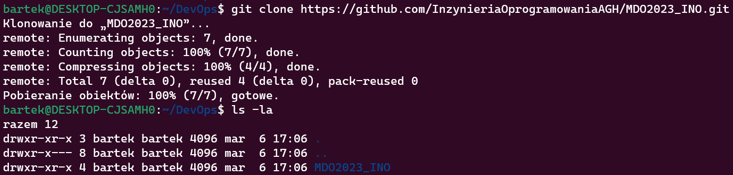

# Sprawozdanie 1 - GitHub
### Bartlomiej Kowal

...

##Wprowadzenie, Git, Galezie, SSH
#1.Zainstaluj klienta Git i obsługę kluczy SSH
#2.Sklonuj repozytorium https://github.com/InzynieriaOprogramowaniaAGH/MDO2023_INO za pomocą HTTPS

