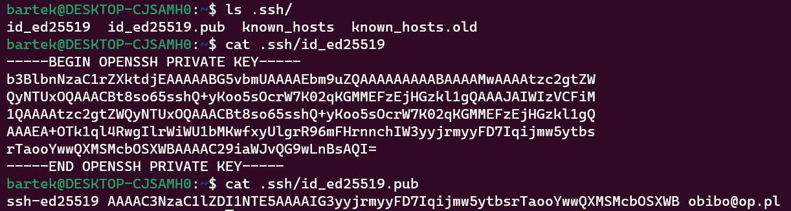
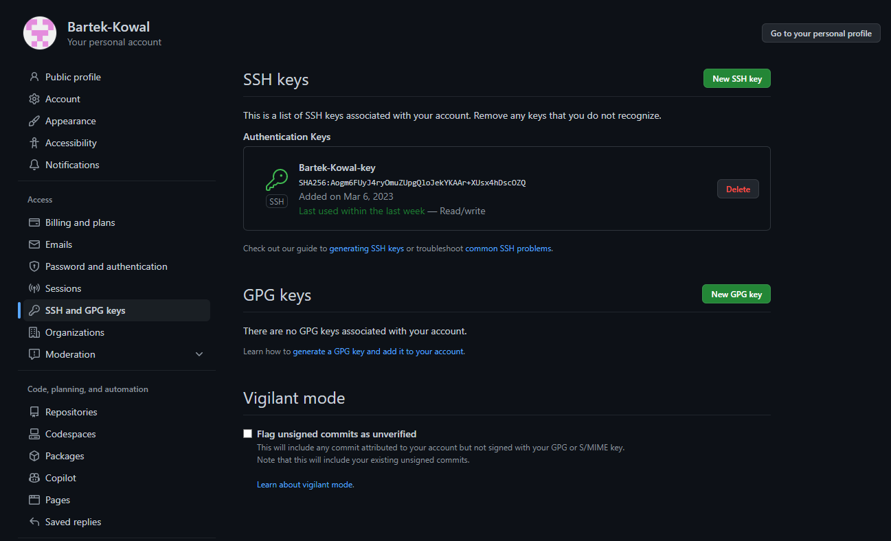
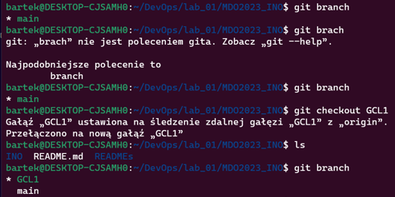
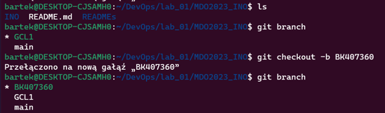
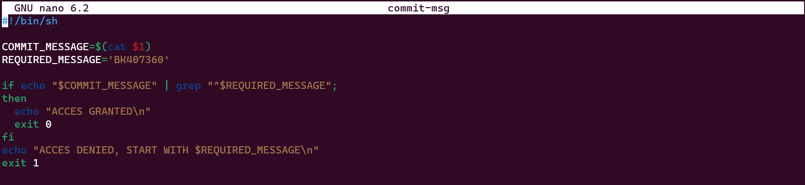
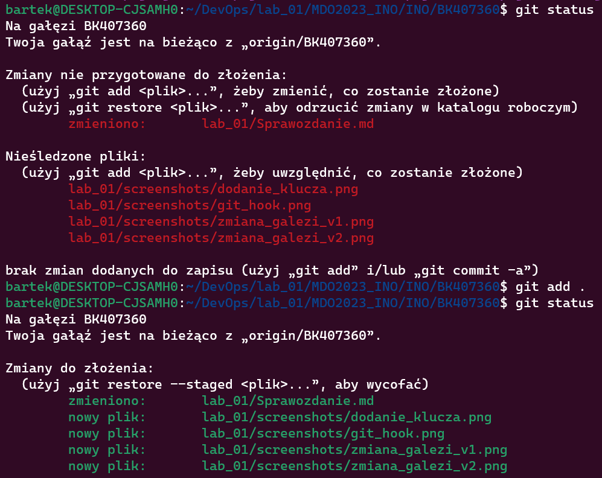

# Sprawozdanie 1 - GitHub
### Bartlomiej Kowal

...

## Wprowadzenie, Git, Galezie, SSH

#1. Zainstaluj klienta Git i obsługę kluczy SSH

#2. Sklonuj repozytorium https://github.com/InzynieriaOprogramowaniaAGH/MDO2023_INO za pomocą HTTPS

#3. Upewnij się w kwestii dostępu do repozytorium jako uczestnik i sklonuj je za pomocą utworzonego klucza SSH
+ Utwórz dwa klucze SSH, inne niż RSA, w tym co najmniej jeden zabezpieczony hasłem
+ Skonfiguruj klucz SSH jako metodę dostępu do GitHuba
+ Sklonuj repozytorium z wykorzystaniem protokołu SSH

# Klonowanie repozytorium identycznie jak w przypadku HTTPS tylko wklejamy inny link

# 'git clone git@github.com:InzynieriaOprogramowaniaAGH/MDO2023_INO.git'

#4. Przełącz się na gałąź main, a potem na gałąź swojej grupy (pilnuj gałęzi i katalogu!)

#5. Utwórz gałąź o nazwie "inicjały & nr indeksu" np. KD232144. Miej na uwadze, że odgałęziasz się od brancha grupy!

#6. Rozpocznij pracę na nowej gałęzi

+ Tutaj rozpoczalem tworzenie odpowiednich katalogow, napisalem skrypt weryfikujacy 'commit message' oraz aktualizowalem na biezaco sprawozdanie

