# Sprawozdanie - Lab01

- W pierwszym kroku miałem zainstalować klienta Git i obsługę kluczy SSH, zanim zacząłem cokolwiek pobierać, sprawdziłem, czy nie mam już ich zainstalowanych, pisząc `git –version`  
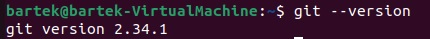  
- Sklonowałem repozytorium za pomocą HTTPS:  
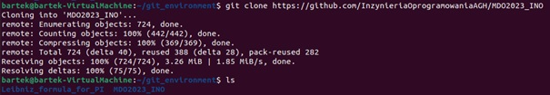  
Zostało zapisane w nowym katalogu, jego zawartość jest dokładnie taka sama, jak zawartość repozytorium spod linku podesłanego w instrukcji.
- Utworzyłem dwa klucze SSH przy użyciu `ssh-keygen`:
    - pierwszy to klucz __dsa__, zabezpieczony hasłem, dlatego przy tworzeniu skorzystam z dwóch opcji: `-t` do określeniu typu klucza SSH oraz `-f` do określenia jego nazwy, pod jaką zostanie zapisany  
    `ssh-keygen -t dsa -f key_dsa`  
    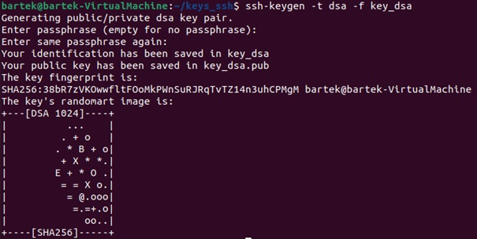  
    Podczas generowania klucza musiałem podać hasło - _passphrase_, przy czym mogłem tez podać jako opcję narzędzia. 
    - drugi z kluczy, to klucz __ecdsa__ o rozmiarze 521 bitów, który zapiszę pod nazwą określającą jego typ:  
    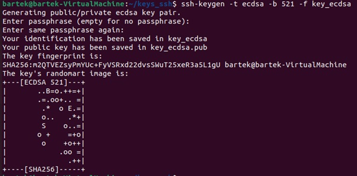  
    Ten klucz nie jest zabezpieczony hasłem, kliknąłem ENTER przy prośbie o hasło, zgodnie z sugestią _empty for no passphrase_.
    - dodałem _passphrase_ do klucza __ecdsa__: `ssh-keygen -p -f key_ecdsa`  
    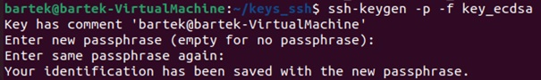 
    - dodałem klucz zabezpieczony hasłem, poleceniem `ssh-add ./key_ecdsa`  
    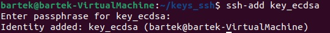 
    - następnie przekopiowałem wygenerowany klucz publiczny do schowka i wkleiłem go do odpowiedniego formularza na GitHubie:  
    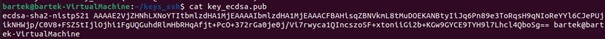  
    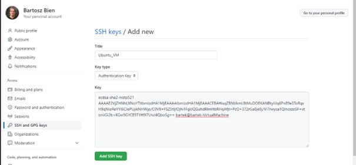  
    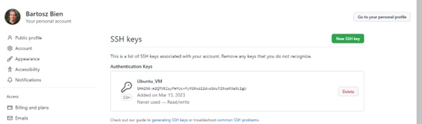  
    - sklonowałem repozytorium przez SSH:  
    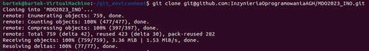 
- przełączyłem się na brach main, a potem na brach ćwiczeniowy swojej grupy laboratoryjnej: `git checkout origin/GCL1`  
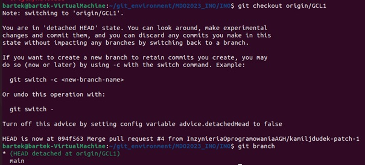 
- utworzyłem nowego brancha poleceniem `git checkout -b BB407460`  
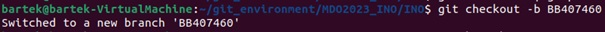 
- stworzyłem nowy katalog we właściwym katalogu o odpowiedniej nazwie:  
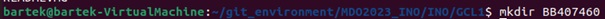 
- utworzyłem nowy plik – Git hooka, przeszedłem do właściwego katalogu:  
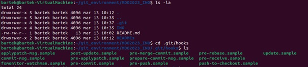 
- stworzyłem nowy plik, w którym zapiszę Git hooka, będzie się nazywać (zgodnie z dokumentacją) __commit-msg__, jego treść jest nastepująca:
```bash
#!/bin/bash
pattern='^BB407460+'
msg="Aborting commmit - must start with >> BB407460 << !"

if ! grep -iqE "$pattern" "$1"; then 
	echo "$msg"
	exit 1;
fi
echo "Commit message OK!"
```
- żeby wszystko poprawnie działało musiałem dodać uprawnienia do wykonania: `sudo chmod 755 commit-msg`  
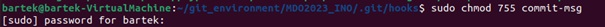 
- przetestowałem, czy Git hook działa – tak, nie przepuszcza commita, gdy nie zawiera __BB407460__ lub gdy się od niego nie zaczyna:  
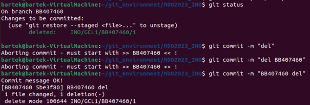 
- wciągnąłem swoje zmiany do gałęzi grupowej:  
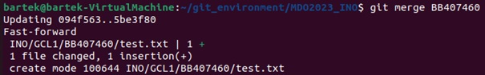 
- na końcu wróciłem na swoją gałąź i wysłałem na _remote_, jak widać – został dodany nowy branch:  
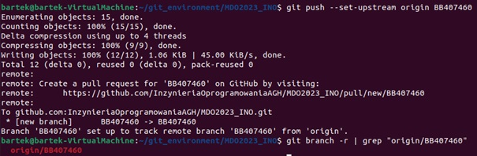 
