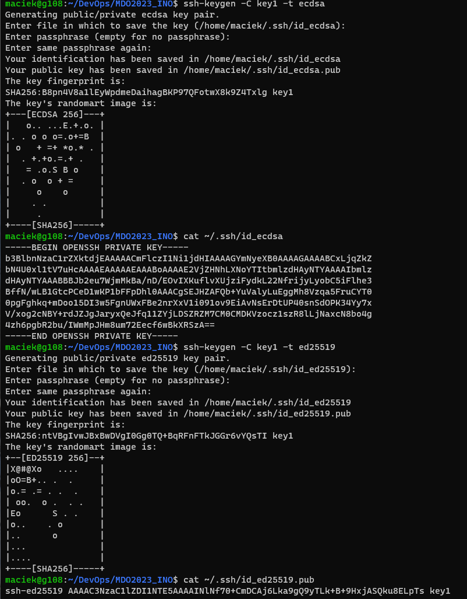
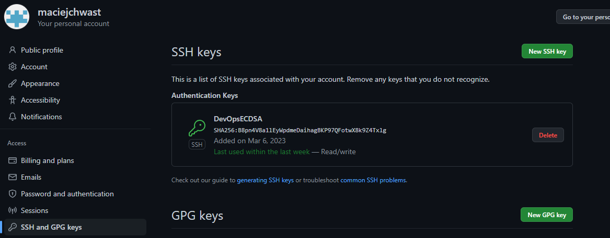
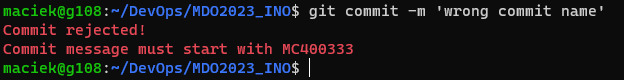

# Sprawozdanie laboratorium 01

---

- Jako początkową metodę autentykacji wybrałem github CLI (command line interface) które zainstalowałem na swojej maszynie za pomocą podanego w repozytorium narzędzia skryptu

```bash
type -p curl >/dev/null || sudo apt install curl -y
curl -fsSL https://cli.github.com/packages/githubcli-archive-keyring.gpg | sudo dd of=/usr/share/keyrings/githubcli-archive-keyring.gpg \
&& sudo chmod go+r /usr/share/keyrings/githubcli-archive-keyring.gpg \
&& echo "deb [arch=$(dpkg --print-architecture) signed-by=/usr/share/keyrings/githubcli-archive-keyring.gpg] https://cli.github.com/packages stable main" | sudo tee /etc/apt/sources.list.d/github-cli.list > /dev/null \
&& sudo apt update \
&& sudo apt install gh -y
```

- Sklonowałem repozytorium używając protokołu https za pomocą komendy `gh repo clone`
- Zgodnie z instrukcją utworzyłem dwa klucze, w tym jeden chroniony hasłem 

- Dodałem klucz w odpowiednie miejsce w profilu na githubie w celu uzyskania autoryzacji przy klonowaniu repozytorium używając SSH


- Stworzyłem git hooka weryfikującego obecność mojego "tagu" skłądającego się z inicjałów oraz numeru indeksu (MC400333). Nazwałem go commit-msg i zawarłem go w ukrytym katalogu .git/hooks. Po stworzeniu i dodaniu zawartości pliku dodałem mu uprawnienia do bycia wykonywalnym poleceniem `chmod +x .git/hooks/commit-msg`. Zawartość hooka prezentuje się następująco:

```bash
#!/bin/sh

commit_message_file=$1
commit_message=$(cat "$commit_message_file")

if ! echo "$commit_message" | grep -q "^MC400333"; then
  printf "\033[1;31mCommit rejected! \nCommit message must start with MC400333\033[0m\n" >&2
  exit 1
fi

```

Po próbie dokonania nieprawidłowo nazwanego commita wyświetlany jest komunikat o nie przyjęciu commita w kolorze czerwonym. Wygląda to następująco:

