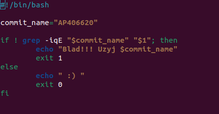
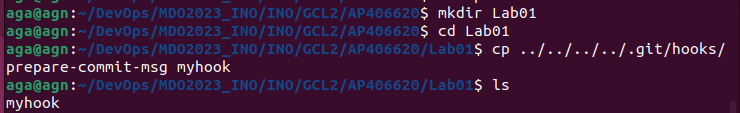

#Sprawozdanie 1

1. Sprawdziłam czy posiadam zainstalowanego klienta Git oraz obsługę kluczy SSH


2. Sklonowałam repozytorium za pomocą HTTPS:


3. Utworzyłam klucz SSH:


Klucz, który używam jako metodę dostępu do GitHuba utworzyłam jeszcze przed zajęciami, za pomocą komendy:

```ssh-keygen -t ed25519 -C "your_email@example.com"```

4. Dodałam klucz do swojego konta na GitHub:


5. Sklonowałam repozytorium za pomocą SSH:


6. Z gałęzi main przełączyłam się na gałąź grupy:


7. Stworzyłam gałąź zawierającą moje inicjały i numer indeksu, a następnie rozpoczełam na niej pracę:


8. W katalogu grupy stworzyłam katalog o tej samej nazwie co gałąź:


9. Stworzyłam Git hook'a weryfikującego "commit message":


Treść pliku:



11. Skopiowałam go do swojego katalogu z plikami:



12. Stworzyłam plik ze sprawozdaniem:


13. Wysłałam zmiany do zdalnego źródła:


14. Wciągnełam gałąź do gałęzi grupowej:


!!Przy commicie nie zadziałał hook, dlatego naprawiłam błąd i wykonałam test:


Wyświetliła się ":)" zatem hook zaczął działać poprawnie.
