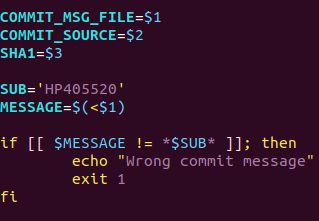
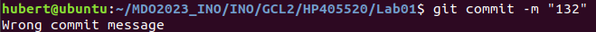

# Sprawozdanie - Metodyki Dev/Ops - Lab 1 

## Podjete kroki:

1.Sklonowanie repozytorium, najlpierw przez https, a potem przez ssh poleceniem `git clone` 

2.Przelaczenie sie na branch cwiczeniowy(GCL2), poleceniem `git checkout`, a potem stworzenie
wlasnego brancha(HP405520) przez to samo polecenie z flaga `-b` 

3.Utworzenie katalogu o nazwie brancha i napisanie git hooka, ktory sprawdza czy commit message
zawiera inicjaly i numer indeksu. Hook przedstawia sie tak:

4.A w ten sposob dziala hook przy zlym commit message:

