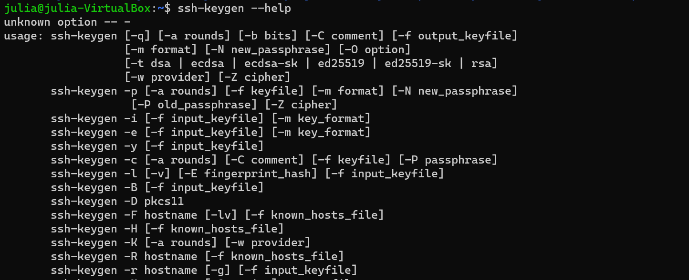
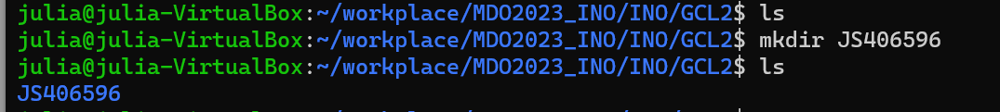

# Sprawozdanie 1
1. Sprawdziłam czy na maszynie zainstalowane zostały klient git oraz obsługa kluczy SSH.
   
   
2. Sklonowałam repozytorium za pomocą HTTPS.
   
3. Utworzyłam parę kluczy SSH i skonfigurowałam je jako metodę dostępu do githuba. Następnie ponownie sklonowałam repozytorium, tym razem za pomocą SSH.
   
   
4. Przełączyłam się na gałąź swojej grupy.
   
5. Utworzyłam własną gałąź i przełączyłam się na nią.
   
6. Utworzyłam katalog o takiej samej nazwie jak gałąź.
   
   - Stworzyłam githooka, weryfikującego, że każdy commit message rozpoczyna się od 'JS406596' i nadałam odpowiednie uprawnienia.
     
     
   - Treść githooka.
     
   - Dodałam plik ze sprawozdaniem.
     
   - Wysłałam zmiany do zdalnego źródła.
     
     
