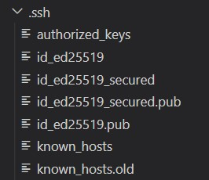
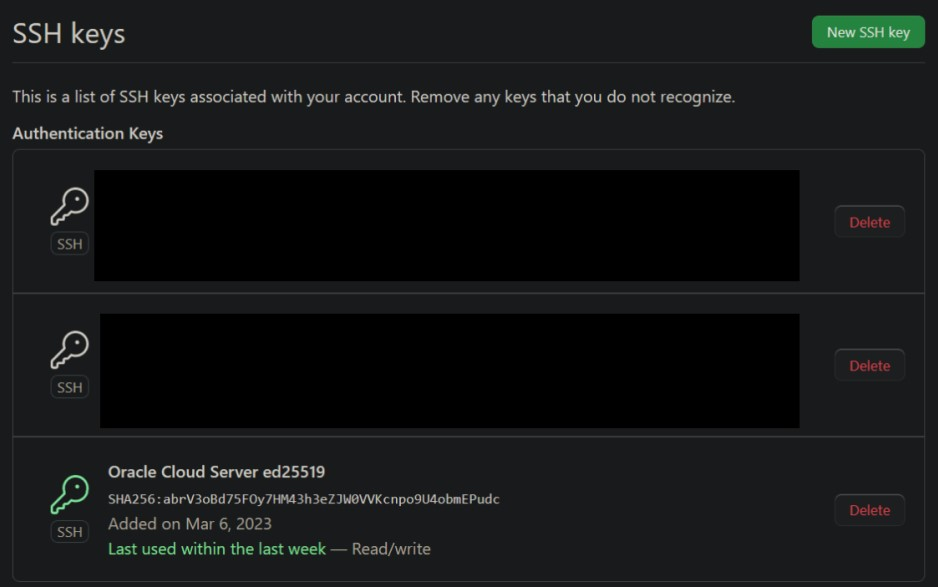
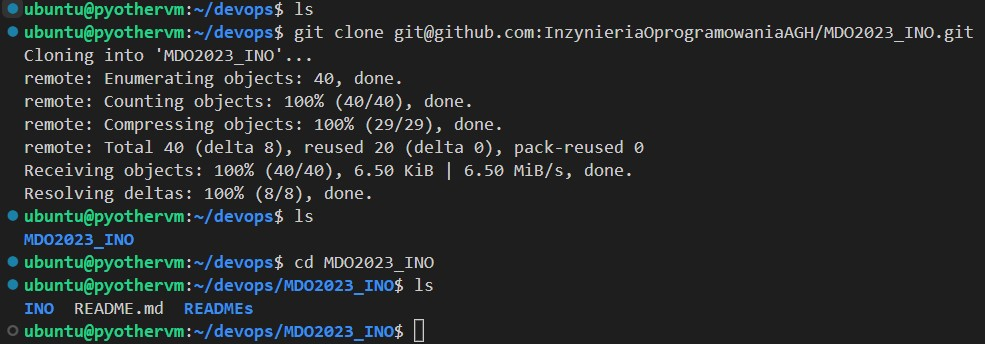
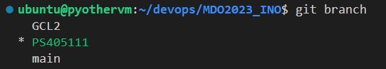

<h1>Sprawozdanie z Laboratorium nr.1</h1>

<h2>Realizacja poleceń</h2>

* Za pomocą polecenia `ssh-keygen` wygenerowano klucz publiczny i prywatny dla protokołu ssh. Klucze zostały zapisane w folderze `/home/ubuntu/.ssh`. Klucze są zabezbieczone szyfrem ed25519, jeden z nich został zabezpieczony hasłem. Wygenerowne klucze publiczne dodano do authorized_keys. 

    


* Nadano kluczom odpowiednie prawa dostępu: 
    ```
    chmod 600 id_ed25519
    chmod 644 id_ed25519.pub
    ```

* Dodanie klucza ssh do Githuba.

    

* Sklonowano podane repozytorium za pomocą https. 

    

* Sklonowano podane repozytorium za pomocą ssh.

    

* Przełączono na gałąź main, następnie na gałąź GCL2. Utworzono nową gałąź za pomocą polecenia: 
    ```
    git checkout PS405111
    ```
    Wynik powyższych operacji:

    

* Utworzono odpowiednią strukturę katalogów i dodano plik ze sprawozdaniem w formacie Markdown. 

* Utworzono hook pre-commit. 


