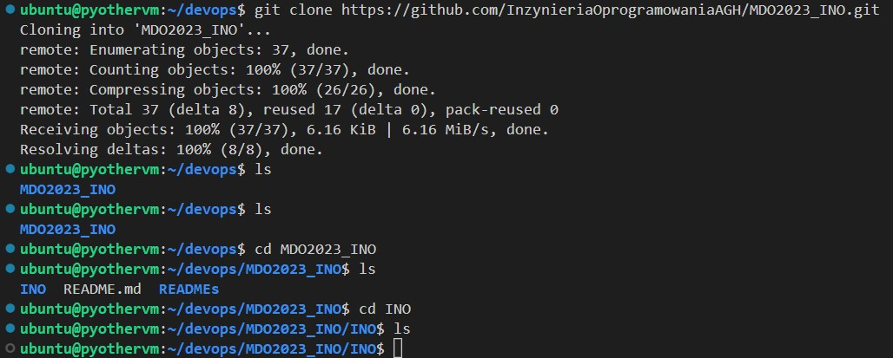

<h1>Sprawozdanie z Laboratorium nr.1</h1>

<h2>Realizacja poleceń</h2>

* Za pomocą polecenia `ssh-keygen` wygenerowano klucz publiczny i prywatny dla protokołu ssh. Klucze zostały zapisane w folderze `/home/ubuntu/.ssh`. Klucze są zabezbieczone szyfrem ed25519, jeden z nich został zabezpieczony hasłem. Wygenerowne klucze publiczne dodano do authorized_keys. 

    


* Nadano kluczom odpowiednie prawa dostępu: 
    ```
    chmod 600 id_ed25519
    chmod 644 id_ed25519.pub
    ```

* Dodanie klucza ssh do Githuba.

    

* Sklonowano podane repozytorium za pomocą https. 

    

* Sklonowano podane repozytorium za pomocą ssh.

    

* Przełączono na gałąź main, następnie na gałąź GCL2. Utworzono nową gałąź za pomocą polecenia: 
    ```
    git checkout PS405111
    ```
    Wynik powyższych operacji:

    

* Utworzono odpowiednią strukturę katalogów i dodano plik ze sprawozdaniem w formacie Markdown. 

* Utworzono skrypt bash prepare-commit-msg. Do zmiennej commit_msg_file przypisywana jest nazwa wiadomości commita. Następnie, za pomocą polecenia `head -n 1` pobierana jest pierwsza linia wiadomości, za za pomocą `grep` werifikowane jest czy zaczyna się od 'PS405111". 

    

* Wciągnięto gałąź 'PS405111' do gałęzi grupowej.

    

<h2>Treść hooka</h2>

```bash
#!/bin/bash

commit_msg_file=$1

if ! head -n 1 $commit_msg_file | grep -q "^PS405111"; then
    printf "\033[1;31mInvalid commit message.\n"
    echo "It has to start with 'PS405111'\033"
    exit 1
fi

```
