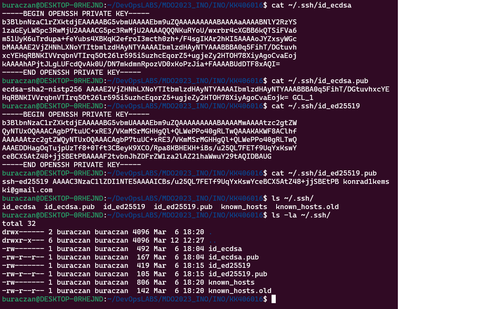
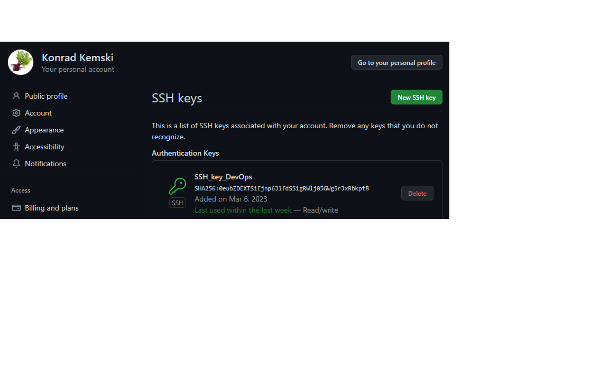

# SPRAWOZDANIE
### Konrad Kemski 406016 GCL1
---
* Na początku stworzyłem 2 różne klucze SSH 

* Następnie w ustawieniach profilu na GitHub dodałem swój klucz SSH

* Wybierając na GitHub w zakładce SSH specjalny link i używając komendy
```bash
git clone [nasz link]
```
  byłem w stanie skopiować na moją maszynę naszego GitHuba
* Utworzyłem własnego brancha i katalog z moimi inicjałami i indeksem
---
* Naszym zadaniem było utworzenie GitHooka sprawdzającego czy nasze wiadmości w commitach
  rozpoczynają się od naszych inicjałów i numeru indeksu
  W taki sposób prezentuje się mój GitHook:

* Potem pozostało jedynie dodać pliki z zrzutami ekranu oraz sprawozdaniem
