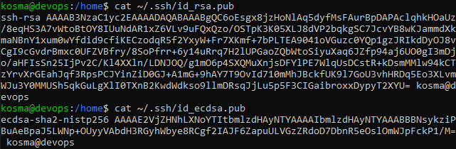
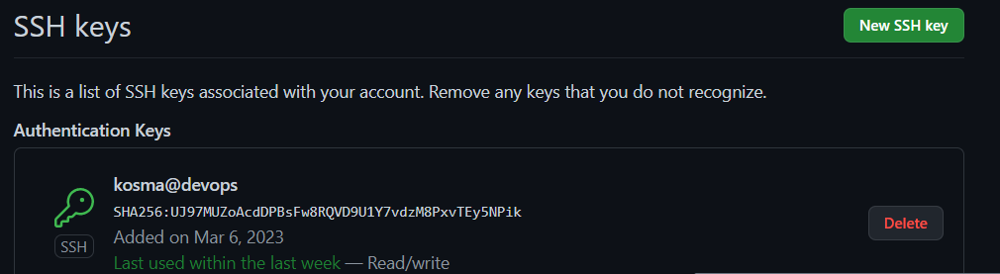
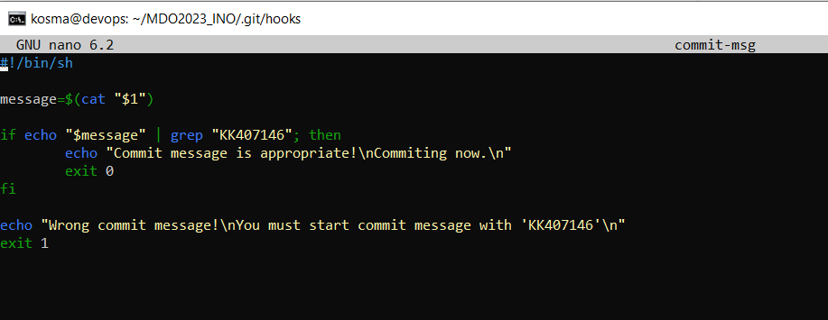

# Sprawozdanie 1

### _Kosma Knap 407146 GCL1_

* Stworzenie dwóch różnych kluczy _SSH_:


Jeden z kluczy to klucz RSA, drugi to klucz ECDSA.

* Podpięcie klucza pod konto GitHub:



* Sklonowanie repozytorium:
```bash
git clone git@github.com:InzynieriaOprogramowaniaAGH/MDO2023_INO.git
```

* Stworzenie git hooka, który sprawdza czy commit zaczyna się od 'KK407146':


 ---
