Sprawozdanie laboratorium 1 - Justyna Ślósarz

1.Zainstalowano klienta Git i obsługę kluczy SSH:
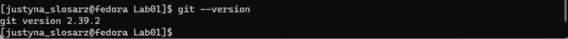

2.Sklonowano repozytorium https://github.com/InzynieriaOprogramowaniaAGH/MDO2023_INO za pomocą HTTPS:
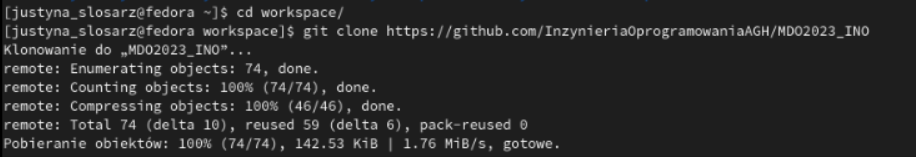

3.Utworzono klucze ssh w folderze .ssh, następnie sklonowano repozytorium za pomocą utworzonego klucza SSH:
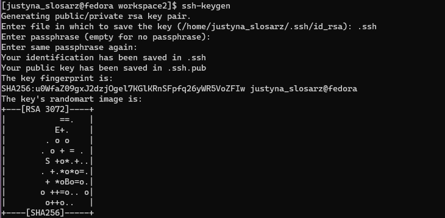

4.Przełączono się na gałąź main, a potem na gałąź swojej grupy(GCL6):
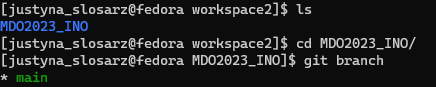
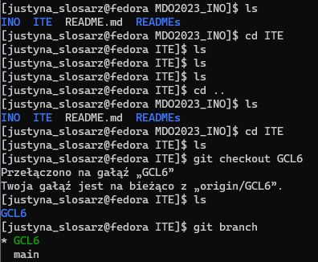

5.Utworzono gałąź o nazwie "JS408301" i rozpoczęto pracę na tejże gałęzi:
- W katalogu właściwym dla grupy utworzono nowy katalog, o nazwie "JS408301":
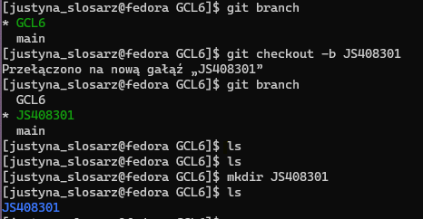

- Napisano Git hook'a - skrypt weryfikujący informację o tym, że każdy "commit message" musi zaczynać się od "JS408301":
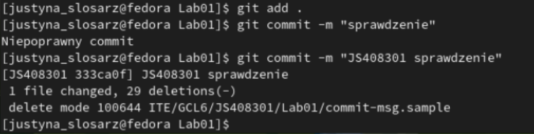

- Dodano skrypt do stworzonego wcześniej katalogu:
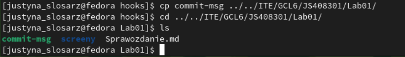

- Skopiowano go we właściwe miejsce, tak by uruchamiał się za każdym razem kiedy robiony jest commit, tak jak zostało przedstawione to wyżej.
- Umieszczono treść githooka w sprawozdaniu.
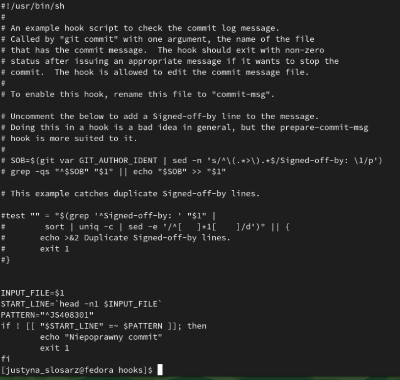

- W katalogu dodano plik ze sprawozdaniem:
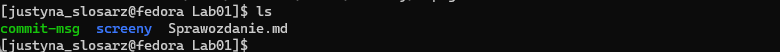

- Dodano zrzuty ekranu, a następnie wysłano zmiany do zdalnego źródła:
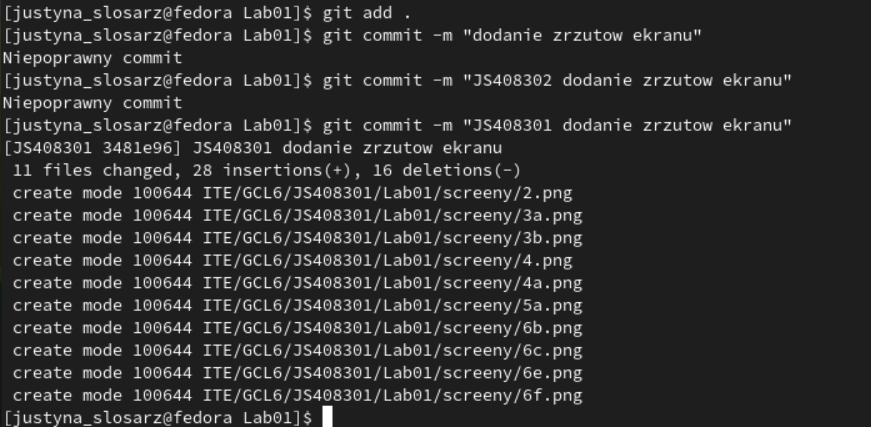
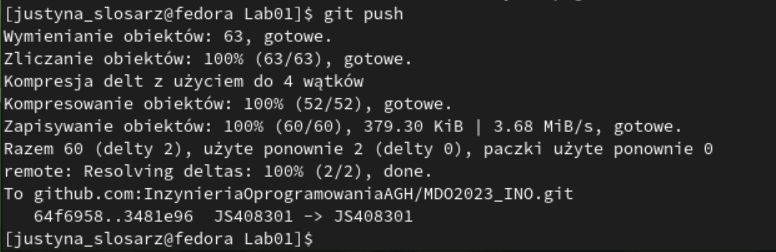

- Wciągnięto swoją gałąź do gałęzi grupowej:
- Zaktualizowano sprawozdanie i zrzuty o poprzednie kroki i wysłano aktualizację do zdalnego źródła:

