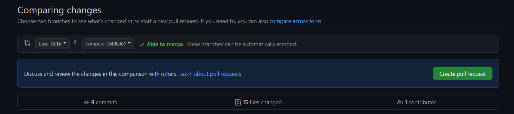

#Sprawozdanie laboratorium 1 - Justyna Ślósarz

1.Zainstalowano klienta Git i obsługę kluczy SSH:

2.Sklonowano repozytorium https://github.com/InzynieriaOprogramowaniaAGH/MDO2023_INO za pomocą HTTPS:

3.Utworzono klucze ssh w folderze .ssh, następnie sklonowano repozytorium za pomocą utworzonego klucza SSH:

4.Przełączono się na gałąź main, a potem na gałąź grupy (GCL6):

5.Utworzono gałąź o nazwie "JS408301" i rozpoczęto pracę na tejże gałęzi:

- W katalogu właściwym dla grupy utworzono nowy katalog, o nazwie "JS408301":

- Napisano Git hook'a - skrypt weryfikujący informację o tym, że każdy "commit message" musi zaczynać się od "JS408301":

- Dodano skrypt do katalogu "JS408301":

Skrypt uruchamiał się za każdym razem kiedy robiony był commit, tak jak zostało przedstawione to wyżej.

- Treść githooka zaprezentowano poniżej:

- W katalogu dodano plik ze sprawozdaniem:

- Dodano zrzuty ekranu, a następnie wysłano zmiany do zdalnego źródła:

- Wciągnięto swoją gałąź do gałęzi grupowej:

