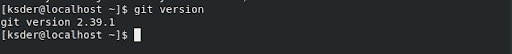
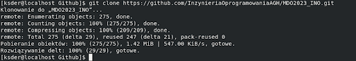
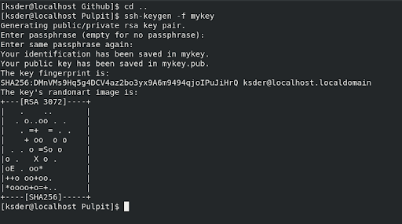
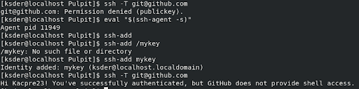

## Kacper Suder 408408
---
Sprawozdanie z Laboratorium numer 1
---
1. Przed zajęciami zainstalowano klienta Git:

2. Sklonowano repozytorium przy użyciu html

3. Utworzono klucz ssh z opcją -f tworzącą go w aktualnie znajdującej się lokalizacji:

- w celu poprawności połączenia należało dodać identyfikator. Następnie sprawdzono poprawność połączenia:

