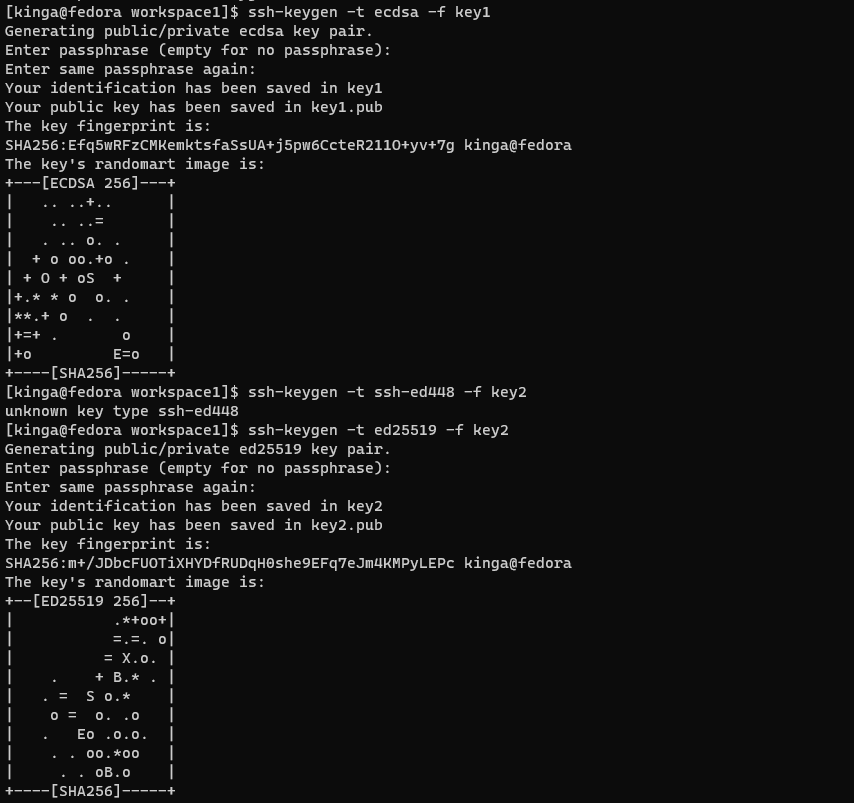

Kinga Tora 

nr indeksu: 407985

Informatyka techniczna, grupa 6

---
# <p style="text-align: center">  **Sprawozdanie 1**</p>

<p style="text-align: justify"> 1. Na początku pracy należało zaistalować klienta Git. W związku z tym, że krok ten został wykonany już wcześniej, jego istnienie udowodniono na poniższym zrzucie ekranu gdzie widoczna jest wersja. </p>


 <p style="text-align: justify"> 2. W dalszym kroku sklonowano udostępnione repozytorium za pomocą HTTPS używając nastęþującego polecenia:  </p>

```cmd
git clone
```


<p style="text-align: justify">3. Następnie należało utworzyć dwa klucze SSH, które nie będą RSA, w tym co najmniej jeden zabezpieczony hasłem. Do tego wykorzystano polecenie ssh--keygen gdzie jako parametry zastosowano typ algorytmu (pierwszy ecdsa, a drugi ed25519). Obu z nich nadano także nazwę pliku klucza prywatnego. Poniżej zaprezentowano komendy odpowiedzialne za generowanie kluczy.</p>



 <p style="text-align: justify">W celu konfiguracji dostępu do GitHuba wykorzystano utworzony już wcześniej, przed zajęciami klucz SSH algorytmem RSA - jego generowanie polegało na wykorzystnaiu samej komendy:

 ```cmd
 ssh--keygen
 ```
 Poniżej przedstawiono gdzie umiejscowione są te klucze (katalog .ssh). </p>

 

 <p style="text-align: justify">Po dodaniu klucza w ustawieniach na githubie, zakładka SSH and GPG keys wygląda następująco:</p>


 <p style="text-align: justify">Ponownie sklonowano repozytorium z Githuba, lecz tym razem za pomocą SSH. Pozytywny rezultat został przedstawiony poniżej.</p>

 

 <p style="text-align: justify">4. W kolejnym kroku należało przemieścić się na odpowiednią gałąź. W celu zmiany gałęzi należało zastosować polecenie:
 
 ```cmd
 git checkout nazwa
 ```
  Natomiast za pomocą:
  ```cmd
git branch 
```
<p style="text-align: justify">można było zobaczyć na której gałęzi znajdujemy się obecnie.</p>

 <p style="text-align: justify">5. W związku z tym, że tworzenie gałęzi zostało zrealizowane w trakcie ćwiczeń i nie zostało udokumentowane zrzutem ekranu, przedstawniono tylko zmianę gałęzi na tą wcześniej utworzoną, gdzie w nazwie znajdywały się inicjały oraz nr indeksu. </p>
 
 
 
 <p style="text-align: justify"> W celu utworzenia nowej gałęzi oraz przełączenia się na nia wykorzystane było wczesniej polecenie</p>
 
 ```cmd
 git checkout -b KT407985
 ```

 <p style="text-align: justify"> 6. W katalogu właściwym dla grupy utworzono nowy katalog o nazwie składającej sie z inicjałów i indeksu. </p>


 <p style="text-align: justify">Nastęnie utworzono nowy skrypt - git hook'a który miał za zadanie weryfikować dodawane commity i ich nazwy. Skrypt ten utworzono we wcześniej utworzonym katalogu i ponadto umieszczono go także we właściwe miejsce tj. do .git/hooks.</p>


 <p style="text-align: justify">Utworzony githook prezentuje się następująco: </p>


<p style="text-align: justify"> Przetestowano działanie hook'a. Można zaobserwować, że w przypadku błędnie wpisanego komentarza commit nie dochodzi do skutku. Jeżli początek zaczyna się od odpowiednich inicjałów commit zostanie wykonany</p>


 <p style="text-align: justify"> W utworzonym katalogu dodano także nowy plik ze sprawozdaniem.</p>


<p style="text-align: justify">Wszystkie wprowadzone zmiany tj. utworzony hook, a także sprawozdanie plik ze sprawozdaniem został wysłany do zdalnego źródła za pomocą poleceń:</p>

- dodawania

```cmd
git add .
```
- commitowania:
```cmd
git commit -m "KT407985 ..."
```
- pushowania: 
```cmd
git push
```
<p style="text-align: justify"> Poniżej wyświetlono wykonane kroki wraz z informacją o pomyślnym dodawaniu zmian </p>


